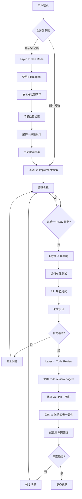

# Quality Assurance Workflow - 质量保障流程

**文档目的**：定义四层质量保障机制，确保代码质量、测试覆盖、架构一致性和环境配置正确性
**适用场景**：所有开发任务，从需求设计到代码提交
**最后更新**：2026-03-24

---

## 背景与动机

### 问题现状

在 Day 2 开发过程中暴露的质量问题：

1. **版本兼容性问题**：Spring Boot 3.2 + MyBatis-Plus 3.5.5 不兼容（反复犯错）
2. **代码与方案不一致**：Project 实体有 `leadId` 字段，但数据库脚本中缺少 `lead_id` 列
3. **环境配置问题**：MySQL 密码错误、JWT secret 长度不足，需要人工干预才发现

### 根本原因

- **缺乏方案设计阶段的验证**：技术选型没有查阅官方兼容性文档
- **缺乏代码审查机制**：写完代码直接提交，没有对比 Plan 和实际代码
- **缺乏环境预检查**：启动失败才被动修复，而不是主动验证

### 解决方案

建立**自动化的四层质量保障机制**，将质量检查**持久化到文档**中，确保：
1. 方案设计时自动验证技术栈兼容性和环境配置
2. 代码完成后进行独立的测试验证（单元测试、API 测试、部署验证）
3. 测试通过后进行代码审查与 Plan 的一致性检查
4. 这些流程能被 AI agent 记住和自动执行

---

## 四层质量保障机制



---

## Layer 1: Plan Mode（方案设计）

### 触发条件

**✅ 必须使用 Plan Mode 的场景：**
- 新功能开发（Day 2, Day 3 等）
- 技术选型变更
- 数据库表结构设计
- 架构调整

**使用工具：** `EnterPlanMode` → Plan agent

### 1.1 技术栈兼容性验证

**检查项：**
- Spring Boot 版本 ↔ MyBatis-Plus 版本兼容性
- Lombok 版本 ↔ Java 版本兼容性
- 前端库版本兼容性（Vue + TypeScript + Vite）

**验证方式：**
- 查阅官方文档的兼容性矩阵
- 查看 GitHub issues 中的已知问题
- 列出推荐的稳定版本组合

**输出格式：**
```
✅ Spring Boot 3.1.5 + MyBatis-Plus 3.5.5 - 官方兼容
❌ Spring Boot 3.2.0 + MyBatis-Plus 3.5.5 - 已知不兼容（issue #5196）
✅ Lombok 1.18.30 + Java 17 - 官方支持
```

### 1.2 环境依赖清单

**必须列出：**
- MySQL 连接信息（host, port, database, username, password）
- Redis 连接信息
- JWT secret 长度要求（>= 512 bits for HS512）
- 必需的环境变量

**验证方式：**
- 检查配置文件中的默认值是否符合要求
- 生成环境配置模板

**输出格式：**
```
配置项          | 当前值              | 要求              | 状态
---------------|-------------------|------------------|------
MySQL password | 'password'        | 用户需提供         | ⚠️ 需确认
JWT secret     | 55 chars (440bit) | >= 64 chars       | ❌ 不符合
Redis host     | localhost         | localhost         | ✅ 正常
```

### 1.3 数据库表结构完整设计

**必须包含：**
- 完整的 CREATE TABLE DDL
- 所有字段的定义（类型、长度、NOT NULL、DEFAULT）
- 索引定义（主键、外键、普通索引）
- 字段与实体类的映射关系

**验证方式：**
- 实体类字段 ↔ 数据库列 一一对应检查
- camelCase ↔ snake_case 命名转换检查

**输出格式：**
```
Entity Field   | DB Column  | Type         | 一致性
---------------|-----------|--------------|--------
id             | id        | BIGINT       | ✅
name           | name      | VARCHAR(100) | ✅
leadId         | lead_id   | BIGINT       | ⚠️ 需添加到 DDL
workspaceId    | workspace_id | BIGINT    | ✅
```

### 1.4 验收标准

**必须定义：**
- 编译成功标准
- 启动成功标准
- API 测试通过标准
- 单元测试覆盖率要求

**输出格式：**
```
- [ ] mvn clean compile - 无错误
- [ ] mvn spring-boot:run - 启动成功，端口 8080
- [ ] curl POST /api/v1/xxx - 返回 200
- [ ] 单元测试覆盖率 >= 80%
```

---

## Layer 2: Implementation（编码实现）

### 自我检查清单（编码过程中）

#### 每完成一个类后检查

**1. 实体类字段与数据库表列是否一致？**
- ✅ 字段名 camelCase ↔ 列名 snake_case
- ✅ 字段类型匹配（Long ↔ BIGINT, String ↔ VARCHAR）
- ✅ 注解正确（`@TableName`, `@TableId`, `@TableField`）

**2. DTO 是否有必要的校验注解？**
- ✅ `@NotNull`, `@NotBlank`, `@Size`, `@Pattern`
- ✅ 校验规则与业务需求一致

**3. Service 方法是否有事务注解？**
- ✅ 写操作：`@Transactional(rollbackFor = Exception.class)`
- ✅ 读操作：`@Transactional(readOnly = true)`

**4. Controller 是否有 Swagger 注解？**
- ✅ `@Tag`, `@Operation`, `@Parameter`

### 配置文件检查

**每修改配置后检查：**
1. `application-dev.yml` 中的密码、密钥长度是否符合要求？
2. 数据库连接 URL 是否正确？
3. 端口配置是否冲突？

---

## Layer 3: Testing（测试验证）

### 触发条件

**✅ 必须进行测试验证的场景：**
- 完成一个 Day 的开发任务（如 Day 2 所有模块完成）
- 修复重要 Bug 之后
- 准备进入 Code Review 之前

**测试粒度**：
- 以一个 Day 的任务为单位统一测试
- 例如：Day 2 完成（workspace + project 模块）→ 统一测试

### 3.1 单元测试验证

**后端测试：**
```bash
cd backend
mvn clean test
```

**验收标准：**
- ✅ 所有单元测试通过（0 failures）
- ⚠️ 测试覆盖率建议 >= 80%（不强制，但鼓励达到）
- ❌ 如有测试失败，返回 Layer 2 修复

**前端测试（当前未实现，未来使用）：**
- 使用 `vue` skill 进行组件单元测试
- 验收标准同上

### 3.2 API 功能测试（手动）

**测试工具**：Postman 或 curl

**测试场景示例：**
```bash
# 示例：测试用户注册
curl -X POST http://localhost:8080/api/v1/auth/register \
  -H "Content-Type: application/json" \
  -d '{"email":"test@example.com","password":"Test@123","username":"testuser"}'

# 示例：测试工作区创建
curl -X POST http://localhost:8080/api/v1/workspaces \
  -H "Content-Type: application/json" \
  -H "Authorization: Bearer {token}" \
  -d '{"name":"Test Workspace","slug":"test-ws"}'
```

**验收标准：**
- ✅ 所有 API 端点返回正确状态码（200/201/400/401/404）
- ✅ 响应数据格式符合 API 规范（`{code, message, data}`）
- ✅ 错误处理符合预期（参数校验、权限校验）
- ❌ 如有 API 测试失败，返回 Layer 2 修复

**未来改进方向**：
- 开发或引入 API 测试 skill（自动化 API 测试）
- 使用 RestAssured 或类似框架

### 3.3 部署验证

**本地启动验证：**
```bash
cd backend
mvn spring-boot:run

# 健康检查
curl http://localhost:8080/actuator/health
```

**验收标准：**
- ✅ 服务启动成功，无报错
- ✅ 健康检查返回 UP 状态
- ✅ 日志中无 ERROR 级别异常
- ❌ 如启动失败，返回 Layer 2 修复

**使用部署工具（可选，MVP 阶段）：**
- 如有测试环境需求，使用 `build-and-deploy` skill
- 验证部署到测试环境的成功性

### 3.4 测试失败处理流程

**场景 1: 单元测试失败**
```
1. 分析失败原因（测试用例错误 vs 代码 Bug）
2. 如果是代码 Bug → 返回 Layer 2 修复
3. 如果是测试用例错误 → 修正测试用例
4. 重新运行测试直到通过
```

**场景 2: API 测试失败**
```
1. 记录失败的 API 端点和错误信息
2. 检查是否是配置问题（数据库连接、Redis 等）
3. 如果是代码 Bug → 返回 Layer 2 修复
4. 如果是环境问题 → 修复环境配置
5. 重新测试直到通过
```

**场景 3: 部署失败**
```
1. 检查编译错误（mvn compile）
2. 检查依赖冲突（mvn dependency:tree）
3. 检查配置文件（application-dev.yml）
4. 返回 Layer 2 修复
5. 重新部署直到成功
```

### 3.5 测试报告格式

```markdown
# Day N 测试报告

## 测试概览
- 测试日期：2026-03-24
- 测试范围：Day 2（workspace + project 模块）
- 测试人：AI Agent
- 测试结果：✅ 通过 / ❌ 失败

## 单元测试结果
- 测试用例总数：20
- 通过：20
- 失败：0
- 测试覆盖率：85%（建议 >= 80%）

## API 功能测试结果
| API 端点 | 方法 | 状态码 | 结果 | 备注 |
|---------|------|--------|------|------|
| /api/v1/auth/register | POST | 201 | ✅ 通过 | - |
| /api/v1/auth/login | POST | 200 | ✅ 通过 | - |
| /api/v1/workspaces | POST | 201 | ✅ 通过 | - |
| /api/v1/workspaces | GET | 200 | ✅ 通过 | - |
| /api/v1/projects | POST | 201 | ✅ 通过 | - |
| /api/v1/projects | GET | 200 | ✅ 通过 | - |

## 部署验证结果
- 编译：✅ 通过
- 启动：✅ 通过
- 健康检查：✅ 通过（UP）

## 问题清单
- 无

## 测试结论
所有测试通过，可以进入 Layer 4: Code Review。
```

---

## Layer 4: Code Review（代码审查）

### 触发条件

**✅ 必须进行 Code Review 的场景：**
- Layer 3: Testing 通过后
- 准备 Git commit 之前

**使用工具：** `superpowers:requesting-code-review` skill

### 4.1 代码与 Plan 一致性检查

**对比项：**
- Plan 中定义的 API 是否都已实现？
- Plan 中定义的字段是否都在实体类和数据库表中？
- Plan 中的技术栈版本是否与实际代码一致？

**检查方式：**
- 读取 Plan 文件（`development-plan.md`）
- 读取实体类文件
- 读取数据库初始化脚本（`V1__init.sql`）
- 逐项比对

**输出格式：**
```
✅ GET /api/v1/workspaces - 已实现
❌ Project.leadId 字段 - 数据库脚本中缺失
✅ Spring Boot 3.1.5 - 版本一致
```

### 4.2 实体类与数据库表一致性检查

**检查逻辑：**
1. 读取所有 `@TableName` 实体类
2. 提取字段列表（排除 serialVersionUID 和静态字段）
3. 读取数据库初始化脚本
4. 解析 CREATE TABLE 语句
5. 字段名转换后对比（`leadId` → `lead_id`）

**验证规则：**
- 实体类的每个字段在表中都有对应的列
- 表中的每个列在实体类中都有对应的字段
- 类型匹配（Long ↔ BIGINT, String ↔ VARCHAR）

**输出格式：**
```
Entity: com.planelite.module.project.entity.Project
Table:  project
✅ id → id (BIGINT)
✅ name → name (VARCHAR)
❌ leadId → lead_id (缺失)
✅ workspaceId → workspace_id (BIGINT)
```

### 4.3 配置文件完整性检查

**检查项：**

**1. MySQL 配置**
- 密码是否为默认值 'password'？（⚠️ 需确认）
- 数据库名是否创建？

**2. JWT 配置**
- secret 长度是否 >= 512 bits？
- expiration 是否合理？（7天 = 604800000ms）

**3. Redis 配置**
- host 和 port 是否正确？
- 是否需要密码？

**4. 日志配置**
- 是否配置了合理的日志级别？
- 敏感信息是否会被打印？

**验证方式：**
- 读取 `application-dev.yml`
- 计算 secret 长度（字符数 × 8 bits）
- 检查默认值

**输出格式：**
```
❌ JWT secret: 55 chars (440 bits) - 需要 >= 64 chars
⚠️ MySQL password: 'password' - 是否为实际密码？
✅ Redis host: localhost - 正常
```

### 4.4 静态检查和配置审查

**注意**：编译和启动验证已在 Layer 3: Testing 阶段完成

**Code Review 阶段重点**：
1. 代码与 Plan 一致性
2. 实体类与数据库表一致性
3. 配置文件完整性和安全性
4. 代码规范和最佳实践

**不再重复执行**：
- ❌ mvn compile（已在测试阶段执行）
- ❌ mvn spring-boot:run（已在测试阶段执行）
- ❌ API 测试（已在测试阶段完成）

**输出格式：**
```
✅ 所有检查通过，可以提交代码
❌ 发现问题，需要修复后重新审查
```

---

## 实施检查清单

### Plan Mode 阶段检查清单

- [ ] Plan 文档中有"技术栈兼容性"章节
- [ ] 包含完整的 CREATE TABLE 语句
- [ ] 列出了所有环境配置项
- [ ] 定义了明确的验收标准
- [ ] 实体类字段与数据库列一一对应

### Implementation 阶段检查清单

- [ ] 每个实体类都有正确的 MyBatis-Plus 注解
- [ ] 所有 DTO 都有必要的校验注解
- [ ] Service 方法有正确的事务注解
- [ ] Controller 有完整的 Swagger 文档
- [ ] 配置文件中的密码、密钥长度符合要求

### Testing 阶段检查清单

- [ ] 单元测试全部通过（mvn test）
- [ ] 测试覆盖率达到建议值（>= 80%）
- [ ] 所有 API 端点手动测试通过
- [ ] 服务启动成功，健康检查通过
- [ ] 生成测试报告

### Code Review 阶段检查清单

- [ ] 审查报告对比了 Plan 和实际代码
- [ ] 检查了实体类与数据库表一致性
- [ ] 验证了配置文件完整性和安全性
- [ ] 代码符合编码规范
- [ ] 无明显的代码异味

---

## 关键原则

### 记忆持久化

**原则**：工作流程必须写入文档，AI 才能记住和执行

**反例**：❌ 口头告知 AI "记住要检查版本兼容性"
**正例**：✅ 在文档中写明检查清单和验证方式

### 自动化触发

**原则**：定义明确的触发条件，避免遗漏

**触发规则**：
- 用户说"开始 Day N"时 → 自动进入 Plan Mode
- 完成一个 Day 任务后 → 自动触发 Testing
- 测试通过后 → 自动触发 Code Review
- 审查通过后 → 可以提交代码

### 检查清单化

**原则**：可验证、可追溯的检查清单

**好的检查清单特征**：
- ✅ 明确的检查项（不是模糊的"检查代码质量"）
- ✅ 可量化的标准（JWT secret >= 64 chars）
- ✅ 具体的验证方式（读取文件、执行命令）
- ✅ 清晰的输出格式（✅/❌/⚠️ 状态）

---

## 常见问题

### Q1: 简单修改也需要 Plan Mode 吗？

**A**: 不需要。Plan Mode 适用于：
- 新功能开发
- 技术选型变更
- 数据库表结构设计
- 架构调整

简单的 Bug 修复、小改动可以直接编码，但完成后仍需 Testing 和 Code Review。

### Q2: Testing 和 Code Review 的区别是什么？

**A**:
- **Testing（Layer 3）**：验证功能是否正常工作（单元测试、API 测试、部署验证）
- **Code Review（Layer 4）**：验证代码是否符合设计（代码 vs Plan、实体 vs 数据库、代码规范）

两者职责不同，不可互相替代。

### Q3: 测试失败和审查失败有何不同？

**A**:
- **测试失败**：功能有 Bug，需要返回 Layer 2 修复代码
- **审查失败**：代码与设计不一致或不符合规范，可能需要返回 Layer 1 调整方案或返回 Layer 2 修改代码

### Q4: 是否会影响开发效率？

**A**: 不会。相比之下：
- Testing 是自动化的，几分钟即可完成
- Code Review 通过 agent 执行，也很快
- 修复因缺少测试和审查导致的 Bug 需要更多时间

前期多花 5-10 分钟测试和审查，可以节省后期数小时的调试时间。

### Q5: 如何确保 AI 记住这些流程？

**A**: 通过三种方式：
1. **文档持久化**：写入 `quality-assurance.md`
2. **CLAUDE.md 引用**：在项目级指导文档中引用
3. **触发条件明确**：定义自动触发规则

---

## 参考资料

- 技术栈兼容性：[Spring Boot 官方文档](https://docs.spring.io/spring-boot/compatibility.html)
- MyBatis-Plus 兼容性：[MyBatis-Plus GitHub Issues](https://github.com/baomidou/mybatis-plus/issues)
- 数据库设计规范：`/docs/conventions/database.md`
- API 设计规范：`/docs/conventions/api.md`
- 开发计划：`/docs/development-plan.md`
- 经验总结：`/docs/lessons-learned.md`
